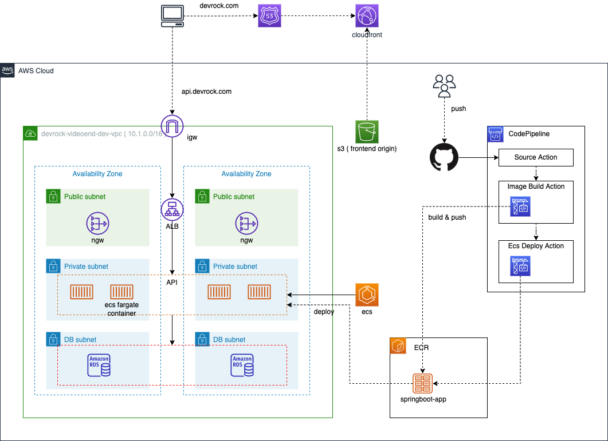
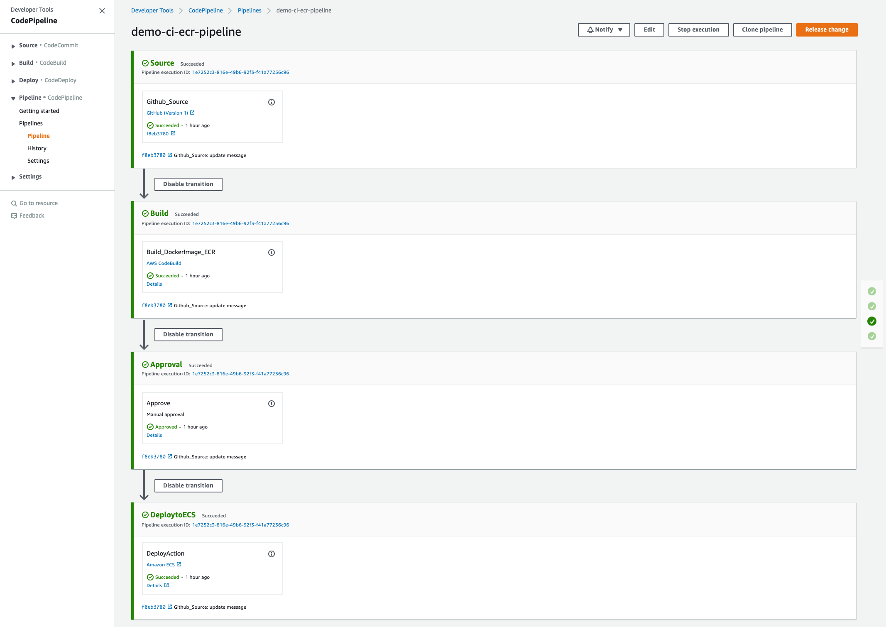

# CDK-ECS-FARGATE-WITH-CICD

## Architecture


## Prerequsites
1. Install Projen
```
npm install projen
```
2. AWS Credentials
 set the AWS_PROFILE environment variable to work-account in AWS
```
export AWS_PROFILE=<<YOUR_AWS_PROFILE>>
```
3. Install Package
Once you have edited .projenrc.js, run the projen command to reflect the changes
```
npx projen
```
You will see that projen automatically generates the package.json, the .gitignore, .npmignore, eslint, jsii configuration, license files, etc., as well as the creation and installation of the package.json

4. CDK Bootstrapping
Deploying AWS CDK apps into an AWS environment (a combination of an AWS account and region) may require that you provision resources the AWS CDK needs to perform the deployment. These resources include an Amazon S3 bucket for storing files and IAM roles that grant permissions needed to perform deployments. The process of provisioning these initial resources is called bootstrapping(https://docs.aws.amazon.com/cdk/latest/guide/bootstrapping.html)
```
cdk bootstrap
```
5. Create Github Token on Secret Manager
```
aws secretsmanager create-secret --name github/oauthtoken
--description "GitHub OAuth Token"
--secret-string '{"oauth_token":"MYOAUTHTOKEN"}' --region us-east-1
```

### How to use
1. Configure src/lib/config.ts
```
//import { Chalk } from 'chalk';

export const envVars = {
  REGION: process.env.REGION || 'ap-northeast-2',
  PROJECT_NAME: 'devrock',
  GIT_PROVIDER: 'github',
  ACM_ARN: <<YOUR_ACM_ARN>>,
  SERVICES: [
    {
      APP_NAME: '<<YOUR_APP_NAME>>',
      REPO_OWNER: '<<GITHUB_OWNER>>',
      REPO_NAME: '<<REPO_NAME>>',
      BUILD_BRANCH: '<<BRANCH>>',
      GITHUB_TOKEN: '<<GITHUB_TOKEN>>',
      PRIORITY: <<NUMBER>>,
      CONDITION: {
        HOST_HEADER: [],
        PATH_PATTERN: ['/*'],
        SOURCE_IP: [],
        QUERY_STRING: [],
      },
    },
  ],
};

```
2. infra build
```
npx projen build
```
3. infra deploy
```
npx projen deploy
```
4. app deploy by cicd 
After finishing build, Approve stage, then deploy your application


